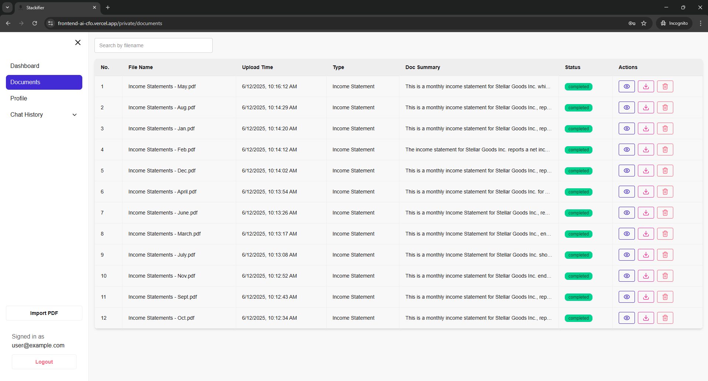
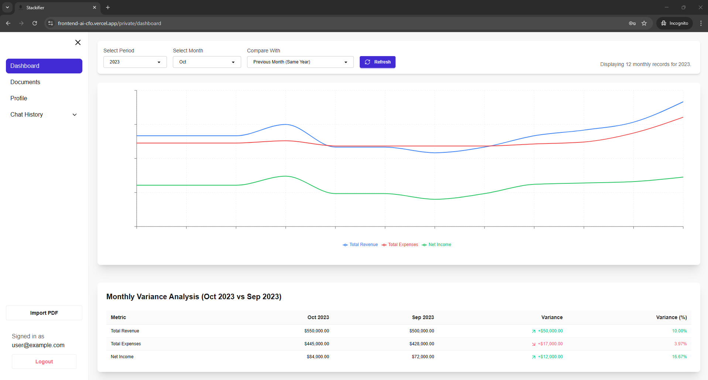
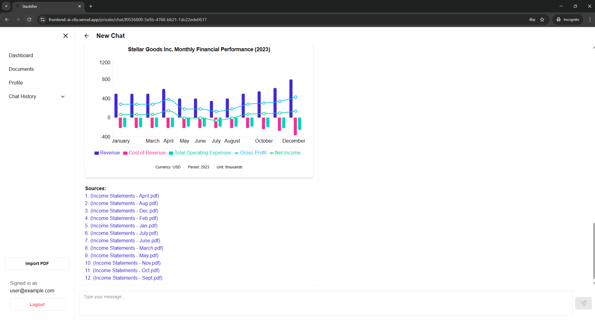
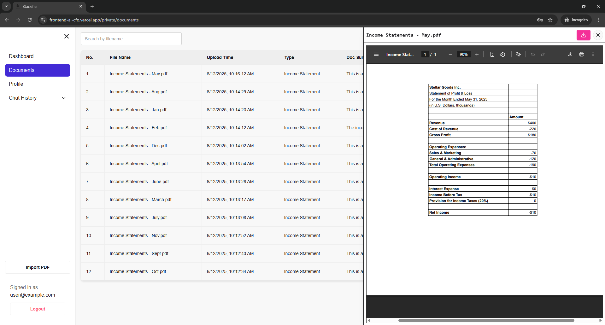
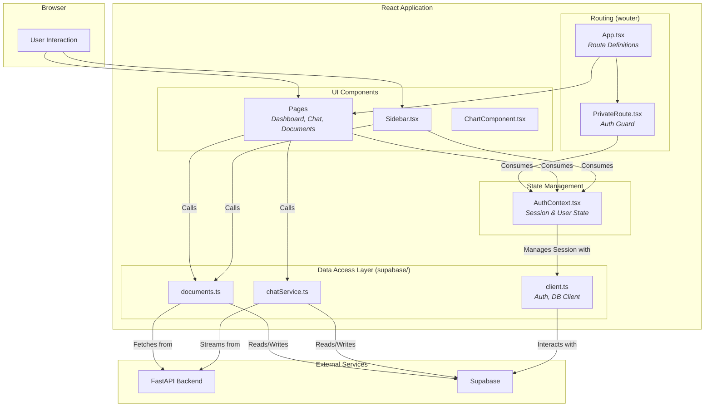

<div align="center">

# 🏦 StackRAG - Frontend

**A Modern, Data-Driven React Interface for Financial AI**

[](https://react.dev/)
[](https://vitejs.dev/)
[](https://www.typescriptlang.org/)
[](https://tailwindcss.com/)

*A responsive, secure, and real-time frontend for the Stackifier AI platform, built with modern web technologies.*

**Backend Source**: [StackRAG-Backend](https://github.com/BryanTheLai/StackRAG-Backend)

<!-- Demo Screenshots -->
<p align="center">
  
  
</p>
<p align="center">
  
    

</p>

[Quick Start](#-quick-start) • [Architecture](#-architecture--data-flow) • [Key Patterns](#-key-architectural-patterns) • [Project Structure](#-project-structure)

</div>

---

## 🚀 Overview

This repository contains the frontend for the Stackifier platform, a responsive single-page application (SPA) built with **React 19**, **Vite**, and **TypeScript**. It provides a secure, multi-tenant user interface for document management, real-time conversational AI, and dynamic financial data visualization.

The architecture emphasizes a clear separation of concerns, robust state management via **React Context**, and a well-defined data access layer for interacting with both the Supabase BaaS and the custom FastAPI backend.

### ✨ Core Capabilities

-   **🔐 Centralized Authentication:** A global `AuthContext` manages the Supabase JWT session, providing a single source of truth for user authentication state across the entire application.
-   **🛡️ Protected Routing:** Implements a `PrivateRoute` component that leverages the auth context to guard access to sensitive pages like dashboards and chat, seamlessly redirecting unauthenticated users.
-   **⚡ Real-Time Data Streaming:** The chat interface (`Chat.tsx`) consumes Server-Sent Events (SSE) from the backend, parsing and rendering streamed AI responses and structured data in real-time.
-   **📊 Dynamic, Data-Driven Visualization:** A reusable `ChartComponent` renders multiple chart types (`bar`, `line`, `pie`, `composed`) based on a standardized JSON schema provided by the backend's LLM agent.
-   **📂 Typed Data Access Layer:** All interactions with external services are encapsulated in a typed `supabase/` directory, ensuring type safety and abstracting away API logic from UI components.
-   **🎨 Modern UI/UX:** Built with **Tailwind CSS** and **DaisyUI**, providing a consistent, themeable, and responsive user experience.

## 🛠 Tech Stack

| Category           | Technology / Library                                       |
| :----------------- | :--------------------------------------------------------- |
| **Framework**      | `React 19`, `Vite`                                         |
| **Language**       | `TypeScript`                                               |
| **Styling**        | `Tailwind CSS 4`, `DaisyUI`                                |
| **Routing**        | `wouter`                                                   |
| **State Management** | `React Context API`                                        |
| **Data Visualization** | `recharts`                                                 |
| **API Client**     | `@supabase/supabase-js`, `fetch` API                       |
| **Markdown**       | `react-markdown` with `remark-gfm`                         |

## 🏗 Architecture & Data Flow

The frontend architecture is designed around a clear, unidirectional data flow, managed by a central authentication context and a dedicated data access layer.



## 🔑 Key Architectural Patterns

This application implements several key patterns crucial for building robust and maintainable SPAs.

### 1. Centralized State Management (`AuthContext.tsx`)

Instead of prop-drilling or using a heavy state management library, authentication is handled by a global React Context (`AuthProvider`).
- **Mechanism:** It wraps the entire application in `App.tsx`. A `useEffect` hook subscribes to Supabase's `onAuthStateChange` listener.
- **Benefit:** This ensures that the application's `session` and `user` state are always in sync with the Supabase authentication service in real-time. Any component can consume this state via the `useAuth` hook, decoupling it from the authentication logic itself.

### 2. Protected Routing (`PrivateRoute.tsx`)

Access to authenticated routes is managed declaratively.
- **Mechanism:** The `PrivateRoute` component wraps protected pages (e.g., `Dashboard`). It consumes the `AuthContext` to check the `session` and `isLoading` state.
- **Flow:**
    1. If `isLoading` is true, it renders a loading indicator.
    2. If `isLoading` is false and no `session` exists, it uses `wouter`'s `Redirect` component to navigate the user to the home page.
    3. If a `session` exists, it renders its `children`.
- **Benefit:** This pattern keeps routing logic clean in `App.tsx` and centralizes the protection logic in one reusable component.

### 3. Abstracted Data Access Layer (`supabase/`)

All external communication is isolated within the `supabase/` directory.
- **Mechanism:** Files like `documents.ts` and `chatService.ts` export typed functions (e.g., `fetchDocuments`, `processDocument`, `fetchChatSessions`). These functions handle the `fetch` calls, header management (including the auth token), and data parsing.
- **Benefit:** UI components remain agnostic of the specific API endpoints or data fetching logic. This makes components more reusable and simplifies future migrations or changes to the backend API.

### 4. Real-Time Streaming & Custom Data Protocol (`Chat.tsx`)

The chat interface is designed for a real-time conversational experience.
- **Mechanism:** It uses the browser's native `EventSource` API (or a polyfill via `fetch` with a `ReadableStream`) to connect to the backend's `/chat/stream` endpoint. As data chunks arrive, a `TextDecoder` processes them.
- **Custom Protocol:** The component includes logic to parse special ` <ChartData>...</ChartData> ` tags embedded within the text stream. It buffers content between these tags until a complete block is received, then parses it as JSON and passes it to the `ChartComponent`.
- **Benefit:** This innovative approach allows the LLM to seamlessly interleave text and complex, structured data (like charts) in a single, continuous stream, creating a rich and dynamic user experience.

## 🚀 Quick Start

### Prerequisites

-   **Node.js 18+** and **npm**
-   A running instance of the **Stackifier Backend API**
-   A configured **Supabase Project**

### ⚙️ Installation & Setup

1.  **Clone the Repository**
    If you've already cloned the backend, the frontend is included. Navigate to the `frontend` directory.

2.  **Install Dependencies**
    ```bash
    cd frontend
    npm install
    ```

3.  **Configure Environment Variables**
    Create a `.env.local` file in the `frontend/` directory and add your Supabase and backend URLs:
    ```env
    # Supabase Credentials (must be prefixed with VITE_)
    VITE_SUPABASE_URL="https://<your-project-ref>.supabase.co"
    VITE_SUPABASE_ANON_KEY="your-anon-key"

    # URL for the running FastAPI backend
    VITE_FASTAPI_BACKEND_URL="http://127.0.0.1:8000"

    # Optional: For pre-filling the login form during development
    VITE_TEST_EMAIL="your_test_email@example.com"
    VITE_TEST_PASSWORD="your_test_password"
    ```

4.  **Run the Development Server**
    ```bash
    npm run dev
    ```

The application will be available at `http://localhost:5173`.

## 📁 Project Structure

```
frontend/
└── src/
    ├── assets/                 # Static assets like images
    ├── components/             # Reusable React components (Sidebar, ChartComponent, etc.)
    ├── config/                 # Centralized configuration (e.g., API endpoints)
    ├── contexts/               # React Context providers (AuthContext.tsx)
    ├── lib/                    # General utility functions (cn for classnames)
    ├── pages/                  # Route components (Home, Login, Dashboard, Chat)
    │   └── private/            # Components for authenticated routes
    ├── supabase/               # Data Access Layer (client, documents, chat services)
    ├── types/                  # TypeScript type definitions (chart.ts)
    ├── App.tsx                 # Root component with routing logic
    ├── main.tsx                # Application entry point
    └── index.css               # Global styles and Tailwind/DaisyUI config
```