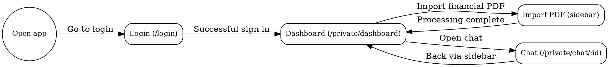

# Stackifier Frontend – User Flow (Graphviz)

```dot
digraph UserFlow {
  rankdir=LR;
  node [shape=rectangle, style=rounded, fontsize=12];

  start      [shape=circle, label="Open app"];
  login      [label="Login (/login)"];
  dashboard  [label="Dashboard (/private/dashboard)"];
  importpdf  [label="Import PDF (sidebar)"];
  chat       [label="Chat (/private/chat/:id)"];

  start -> login         [label="Go to login"];
  login -> dashboard     [label="Successful sign in"];
  dashboard -> importpdf [label="Import financial PDF"];
  importpdf -> dashboard [label="Processing complete"];
  dashboard -> chat      [label="Open chat"];
  chat -> dashboard      [label="Back via sidebar"];
}
```
